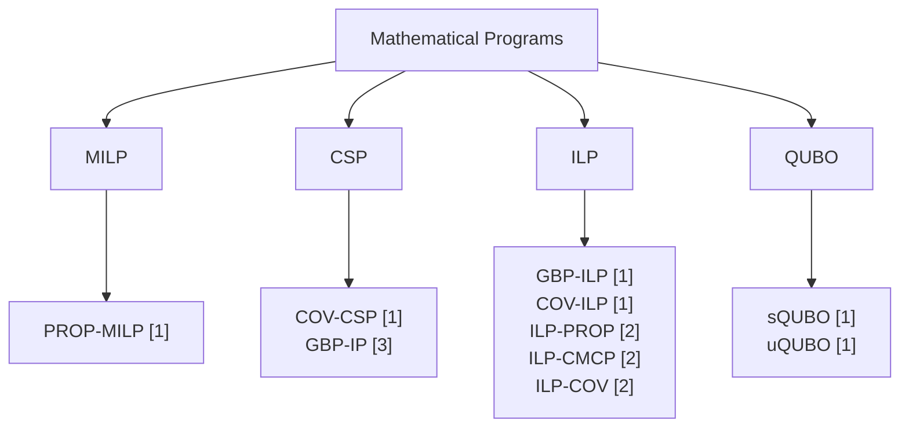

# GBP-MPs
A collection of compact Mathematical Programs for the Graph Burning Problem
# Acronyms
| Header 1 | Header 2 |
| :--- | :---: |
| Graph Burning Problem | GBP |
| Mathematical Program | MP |
| Mixed-Integer LIner Program | MILP |
| Constraint Satisfaction Problem | CSP |
| Integer LInear Program | ILP |
| QUadratic Unconstrained Binary Optimization | QUBO |

