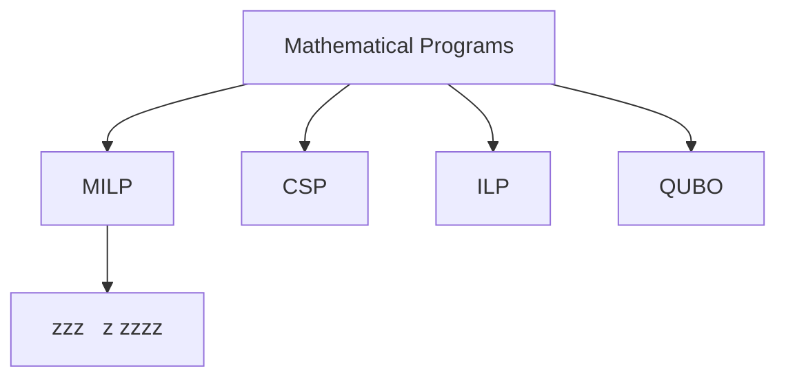

# GBP-MPs
A collection of compact Mathematical Programs for the Graph Burning Problem
#

```mermaid
graph TD;
    MP["Mathematical Programs"] --> MILP;
    MP["Mathematical Programs"] --> CSP;
    MP["Mathematical Programs"] --> ILP;
    MP["Mathematical Programs"] --> QUBO;
    MILP --> PROP-MILP["zzz&nbsp;&nbsp;&nbsp;z&nbsp;zzzz"];
```
