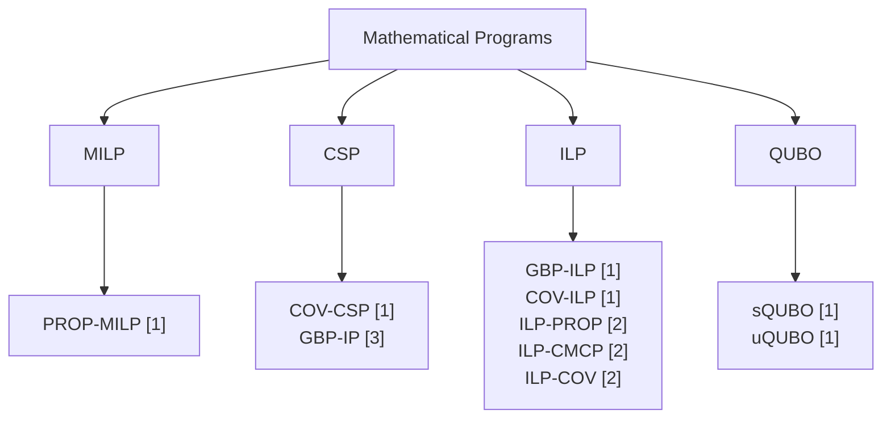

# GBP-MPs
A collection of compact Mathematical Programs for the Graph Burning Problem
# Acronyms
|  | Acronym |
| :--- | :---: |
| Graph Burning Problem | GBP |
| Mathematical Program | MP |
| Mixed-Integer LIner Program | MILP |
| Constraint Satisfaction Problem | CSP |
| Integer Linear Program | ILP |
| Quadratic Unconstrained Binary Optimization | QUBO |
# Diagram

| Program | Variables | Constraints | Binary search | Pros | Cons | Reference |
| :--- | :---: | :---: | :---: | :---: | :---: | :---: |
PROP-MILP | $2Un$ | $Un+U+n$ | $\times$ | Explicit propagation process | Large number of variables and constraints | [1] |
ILP-PROP | $2Un+U$ | $2Un+U$ | $\times$ | Explicit propagation process | Large number of variables and constraints | [2] |
COV-CSP | $gn$ | $g+n$ | $\checkmark$ | Simplest program | Can be infeasible | [1] |
GBP-IP | $gn$ | $g+2n$ | $\checkmark$ | Second simplest | Can be infeasible | [3] |
COV-ILP | $gn$ | $g+n-1$ | $\checkmark$ | Always feasible | Binary search | [1] |
ILP-CMCP | $gn+n$ | $g+n$ | $\checkmark$ | Always feasible | Binary search | [2] |
GBP-ILP | $Un$ | $2U+n-1$ | $\times$ | Most straightforward program | - | [1] |
ILP-COV | $Un+n$ | $2U+n+1$ | $\times$ | Second most straightforward | - | [2] |
sQUBO | $gn+n\lceil \log_2 n \rceil$ | - | $\checkmark$ | No penalty tuning | Slack variables | [1] |
uQUBO | $gn$ | - | $\checkmark$ | Few variables | Penalty tuning | [1] |
# Compile
To compile each cpp file you need Gurobi and GNU GCC installed in your system. In particular, we used Gurobi 12.0.3 and GNU GCC 14.2.0.
For instance, to compile GBP-ILP run the following command.

```
sudo g++ -w -Wall GBP-ILP.cpp -o GBP-ILP -I${GUROBI_HOME}/include -L${GUROBI_HOME}/lib -lgurobi_c++ -lgurobi120
```
To run the executable of PROP-MILP, ILP-PROP, GBP-ILP, and ILP-COV you need to add the path to the graph instance and the value of the upper bound U.

```
./GBP-ILP /dataset/soc-livejournal.mtx 15
```
The input graph must be in mtx format. Namely, the first line has the number of vertices, the second line has the number of edges, and the remaining lines have pairs of vertices (edges) separated by a blank space. The folder dataset contains some graphs in this format. There must be exactly one line for each edge.
