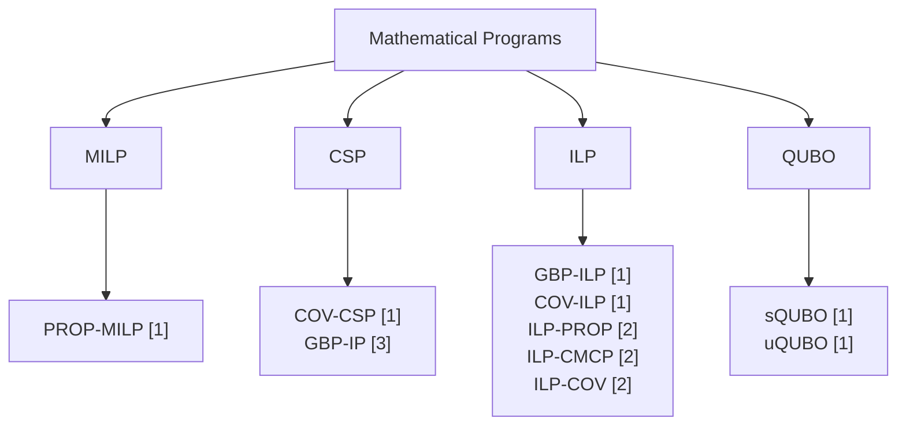

# Mathematical Programs for the Graph Burning Problem
This repository contains C++ implementations of several of the main mathematical programming models for the Graph Burning Problem, all developed using the Gurobi C++ API.
# Acronyms
|  | Acronym |
| :--- | :---: |
| Graph Burning Problem | GBP |
| Mixed-Integer Linear Program | MILP |
| Constraint Satisfaction Problem | CSP |
| Integer Linear Program | ILP |
| Quadratic Unconstrained Binary Optimization | QUBO |
# Diagram
The implementations are organized into the following categories:

# Comparative table
| Program | Variables | Constraints | Binary search | Pros | Cons | Reference |
| :--- | :---: | :---: | :---: | :---: | :---: | :---: |
PROP-MILP | $2Un$ | $Un+U+n$ | $\times$ | Explicit propagation process | Large number of variables and constraints | [1] |
ILP-PROP | $2Un+U$ | $2Un+U$ | $\times$ | Explicit propagation process | Large number of variables and constraints | [2] |
COV-CSP | $gn$ | $g+n$ | $\checkmark$ | Simplest program | Can be infeasible | [1] |
GBP-IP | $gn$ | $g+2n$ | $\checkmark$ | Second simplest | Can be infeasible | [3] |
COV-ILP | $gn$ | $g+n-1$ | $\checkmark$ | Always feasible | Binary search | [1] |
ILP-CMCP | $gn+n$ | $g+n$ | $\checkmark$ | Always feasible | Binary search | [2] |
GBP-ILP | $Un$ | $2U+n-1$ | $\times$ | Most straightforward program | - | [1] |
ILP-COV | $Un+n$ | $2U+n+1$ | $\times$ | Second most straightforward | - | [2] |
sQUBO | $gn+n\lceil \log_2 n \rceil$ | - | $\checkmark$ | No penalty tuning | Slack variables | [1] |
uQUBO | $gn$ | - | $\checkmark$ | Few variables | Penalty tuning | [1] |
# Gurobi setup on Ubuntu 26.04
If Gurobi for C++ is not installed, then follow the next steps:
1. Download Gurobi optimizer (.tar.gz) from https://www.gurobi.com/product/download-center/
2. Extract the folder on your preferred path.
3. Identify GUROBI_HOME, which might be similar to /home/username/gurobi120/linux64
4. On a terminal, type:
```
nano ~/.bashrc
``` 
5. Add
```
export GUROBI_HOME=/home/username/gurobi120/linux64
export LD_LIBRARY_PATH=$GUROBI_HOME/lib:$LD_LIBRARY_PATH
```
6. Close your terminal for the changes to take effect.
7. Do not forget to ask Gurobi for an academic license: https://www.gurobi.com/academics
# Compile and run
To compile each cpp file you need Gurobi and GNU GCC installed in your system. In particular, we used Gurobi 12.0.3 and GNU GCC 14.2.0.
For instance, to compile GBP-ILP run the following command.

```
sudo g++ -w -Wall GBP-ILP.cpp -o GBP-ILP -I${GUROBI_HOME}/include -L${GUROBI_HOME}/lib -lgurobi_c++ -lgurobi120
```
To run the executable of PROP-MILP, ILP-PROP, GBP-ILP, GBP-ILP-RG, and ILP-COV you need to add the path to the graph instance and the value of the upper bound U.

```
./GBP-ILP /dataset/soc-livejournal.mtx 15
```
All the other programs do not require an upper bound U. Besides, the input graph must be in mtx format. Namely, the first line has the number of vertices, the second line has the number of edges, and the remaining lines have pairs of vertices (edges) separated by a blank space. The folder dataset contains some graphs in this format. There must be exactly one line for each edge.
# GBP-ILP with row generation: GBP-ILP-RG
According to empirical results, the "best" program is GBP-ILP. Of course, such apparent superiority is biased towards the evaluation tool, which in this case is Gurobi. In order to enhance the practicality of GBP-ILP, we implemented GBP-ILP-RG, which adds a row generation technique. The details can be consulted in reference [1].
# References
[1] [Cajica-Maceda, L.B.; Chaurra-Gutiérrez, F.A.; Pérez-Sansalvador, J.C.; García-Díaz, J. Graph Burning: An Overview of Compact Mathematical Programs. Mathematics 2026, 14, 1011. https://doi.org/10.3390/math14061011](https://doi.org/10.3390/math14061011).

[2] [García-Díaz, J., Cornejo-Acosta, J. A., & Trejo-Sánchez, J. A. (2025). A greedy heuristic for graph burning. Computing, 107(3), 91.](https://link.springer.com/article/10.1007/s00607-025-01436-9)

[3] [Pereira, F. D. C., de Rezende, P. J., Yunes, T., & Morato, L. F. B. (2024). A row generation algorithm for finding optimal burning sequences of large graphs. In 32nd Annual European Symposium on Algorithms (ESA 2024) (pp. 94-1). Schloss Dagstuhl–Leibniz-Zentrum für Informatik.](https://drops.dagstuhl.de/entities/document/10.4230/LIPIcs.ESA.2024.94#:~:text=In%20*A%20Row%20Generation%20Algorithm%20for%20Finding,million%20vertices%20in%20less%20than%2019%20minutes.)
# Contact
bcajica@inaoep.mx \
chaura@inaoep.mx \
jcp.sansalvador@inaoep.mx \
jesus.garcia@secihti.mx
